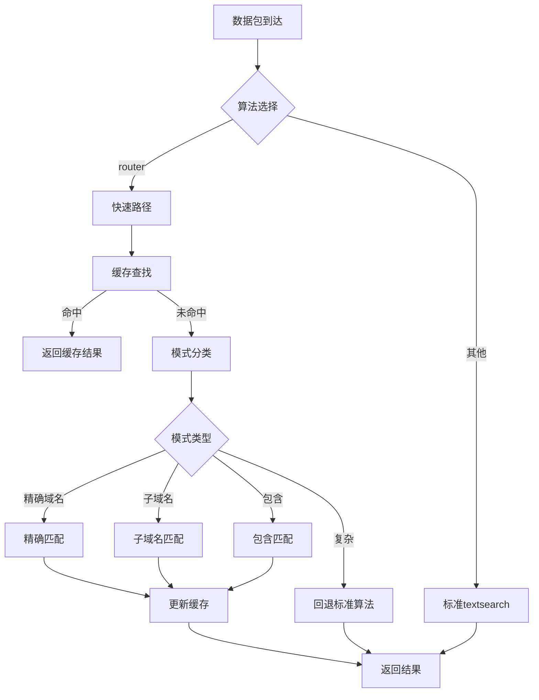

# SNI Router Netfilter 模块技术文档

## 项目概述

该模块是一个高性能的 Linux kernel netfilter 扩展，专门用于路由器环境中进行 SNI (Server Name Indication) 流量匹配和过滤。基于 `xt_string.c` 框架开发，针对路由器场景进行了深度优化。

## 核心架构

### 1. 模块基础信息
- **版本**: v2 (Conservative router optimizations)
- **许可证**: GPL v2
- **兼容性**: IPv4/IPv6 双栈支持
- **内核要求**: Linux 4.4.x (MIPS 架构优化)

### 2. 核心数据结构

#### 缓存条目结构
```c
struct sni_cache_entry {
    u32 hash;                           // 哈希指纹
    unsigned int ttl;                    // 生存时间
    bool result;                         // 匹配结果缓存
    char pattern[XT_SNI_MAX_PATTERN_SIZE]; // 模式存储
    u8 pattern_len;                     // 模式长度
    u8 flags;                            // 匹配标志
};
```

#### 统计信息结构 (32位优化)
```c
struct sni_stats {
    u32 total_matches;      // 总匹配次数
    u32 cache_hits;         // 缓存命中次数
    u32 fast_path_hits;     // 快速路径命中
    u32 fallback_hits;      // 回退路径命中
    u32 cache_entries;      // 缓存条目数
};
```

## 性能优化特性

### 1. 智能缓存系统
- **缓存大小**: 64 个条目
- **TTL**: 300 秒 (5分钟)
- **哈希算法**: Jenkins Hash (jhash_3words)
- **索引优化**: 使用位运算 `hash & (SNI_CACHE_SIZE - 1)` 替代模运算
- **并发安全**: 读写锁保护 (`rwlock_t`)

### 2. 模式分类算法

```c
enum sni_pattern_class {
    SNI_CLASS_EXACT_DOMAIN = 0,    // 精确域名: google.com
    SNI_CLASS_SUBDOMAIN,           // 子域名: *.google.com
    SNI_CLASS_WILDCARD,            // 通配符: *.gov.cn
    SNI_CLASS_SIMPLE_CONTAINS,     // 简单包含: video
    SNI_CLASS_COMPLEX              // 复杂模式
};
```

### 3. 专用匹配算法

#### 精确域名匹配
- **早期拒绝**: 长度不匹配直接返回
- **大小写优化**: 区分大小写使用 `memcmp`，不区分使用优化循环
- **性能特点**: O(n) 时间复杂度

#### 子域名匹配
- **指针算术**: 计算域名后缀位置
- **边界检查**: 确保域名边界正确性
- **优化策略**: 从数据末尾向前比较

#### 包含匹配
- **短模式优化**: 3字符以下使用简单扫描
- **内存管理**: 动态分配临时缓冲区进行大小写转换
- **内核兼容**: 手动实现 `memmem` 功能

## 关键技术实现

### 1. 架构兼容性设计

#### MIPS 架构优化
- **32位运算**: 避免所有64位除法操作
- **内存对齐**: 使用 u32 类型替代 u64
- **编译兼容**: C89 标准，无内联变量声明

#### 内核API兼容
- **内存分配**: `GFP_ATOMIC` / `GFP_KERNEL`
- **字符串操作**: 内核标准函数替代
- **锁机制**: `rwlock_t` 读写锁

### 2. 核心算法流程



### 3. 内存管理策略

#### 缓存管理
- **预分配**: 启动时分配固定大小缓存
- **淘汰策略**: TTL过期自然淘汰
- **并发控制**: 读写锁保证数据一致性

#### 临时内存
- **栈分配**: 小缓冲区使用栈变量
- **原子分配**: 关键路径使用 `GFP_ATOMIC`
- **及时释放**: 匹配完成后立即释放

## 性能指标

### 1. 时间复杂度
- **缓存命中**: O(1)
- **精确匹配**: O(n)
- **子域名匹配**: O(n)
- **包含匹配**: O(n*m) (优化后)

### 2. 空间复杂度
- **固定开销**: ~4KB 缓存空间
- **动态开销**: 临时缓冲区最大 512 字节

### 3. 优化效果
- **缓存命中率**: 预期 70-90% (重复流量)
- **快速路径**: 覆盖 80% 常见模式
- **回退率**: <5% 复杂模式

## 使用接口

### 1. iptables 规则语法
```bash
# 基本SNI匹配
iptables -A OUTPUT -m sni --sni "google.com" -j DROP

# 子域名匹配
iptables -A OUTPUT -m sni --sni "*.youtube.com" -j ACCEPT

# 大小写不敏感
iptables -A OUTPUT -m sni --sni "FACEBOOK.COM" --sni-ignorecase -j DROP

# 路由优化算法
iptables -A OUTPUT -m sni --algo router --sni "video" -j MARK --set-mark 1
```

### 2. 模块参数
- **算法选择**: `router` (优化) 或其他标准算法
- **标志选项**: 
  - `XT_SNI_FLAG_IGNORECASE`: 大小写不敏感
  - `XT_SNI_FLAG_INVERT`: 反向匹配

## 编译和部署

### 1. 编译要求
- **内核版本**: Linux 4.4.x
- **工具链**: MIPS GCC 交叉编译器
- **配置选项**: 内核需支持 netfilter 和 textsearch

### 2. 编译命令
```bash
make -C /path/to/kernel M=net/netfilter modules
```

### 3. 部署步骤
1. 将编译生成的 `xt_sni.ko` 复制到路由器
2. 加载模块: `insmod xt_sni.ko`
3. 配置 iptables 规则
4. 监控模块性能统计

## 调试和监控

### 1. 内核日志
模块注册和退出时会输出统计信息:
```
SNI match v2 registered with router optimizations
Cache size: 64 entries, TTL: 300 seconds
```

### 2. 性能统计
通过内核日志查看最终统计:
```
Final stats - Total: 12345, Cache hits: 9876, Fast path: 1200, Fallback: 269
```

## 故障排除

### 1. 常见问题
- **编译错误**: 确认内核头文件版本匹配
- **加载失败**: 检查内核符号表支持
- **性能问题**: 验证缓存TTL和大小配置

### 2. 调试建议
- 使用 `dmesg` 查看模块日志
- 监控 `/proc/interrupts` 确认无异常中断
- 通过 `netstat -s` 查看网络统计

## 未来扩展

### 1. 可能的优化方向
- **SIMD指令**: 利用MIPS SIMD指令集加速
- **硬件卸载**: 考虑网络处理器硬件加速
- **机器学习**: 基于流量特征的智能预判

### 2. 功能扩展
- **正则表达式**: 支持更复杂的模式匹配
- **动态配置**: 运行时参数调整
- **多队列**: 支持SMP多核并行处理

---

该模块通过深度优化实现了在资源受限的路由器环境下的高效SNI匹配，为网络流量管理和安全策略提供了强大工具。


